# 🌱 TerraWeek Day 1 – Introduction to Infrastructure as Code (IaC) & Terraform   

#TrainWithShubham #TerraWeekChallenge

> **Day 1 Goal:** Learn the fundamentals of Infrastructure as Code (IaC), understand Terraform, complete the Terraform workflow, and explore OpenTofu.

---

# 📚 Learning Summary

On Day 1, I learned the fundamentals of **Infrastructure as Code (IaC)** and **Terraform**, installed and configured the Terraform CLI, created my first Terraform project, provisioned local resources, explored the Terraform workflow, and gained hands-on experience with OpenTofu and the Terraform dependency lock file.

---

# 🎯 Task 1: Understanding Infrastructure as Code (IaC)

## What is Infrastructure as Code (IaC)?

Infrastructure as Code (IaC) is the practice of provisioning and managing infrastructure using code instead of manual processes. It enables automation, consistency, scalability, and version control for infrastructure management.

### Benefits of IaC

- Automated infrastructure provisioning
- Consistent and repeatable deployments
- Version-controlled infrastructure
- Reduced manual errors
- Faster deployment process
- Easy collaboration using Git

---

## What is Terraform?


Terraform is an **Infrastructure as Code (IaC)** tool developed by **HashiCorp**.

It allows developers and DevOps engineers to define infrastructure using a declarative language called **HCL (HashiCorp Configuration Language)**.

Terraform automatically figures out the changes required to reach the desired state of the infrastructure.

Unlike many cloud-specific tools, Terraform works across multiple platforms such as:

- AWS
- Azure
- Google Cloud
- Kubernetes
- Docker
- GitHub
- Cloudflare
- DigitalOcean
- VMware
- Many more...

---

# 🏗️ Terraform vs Other IaC Tools

| Tool | Description |
|------|-------------|
| **Terraform** | Declarative, multi-cloud Infrastructure as Code tool. |
| **OpenTofu** | Community-driven open-source fork of Terraform. |
| **Pulumi** | Infrastructure as Code using programming languages like Python, Go, and TypeScript. |
| **AWS CloudFormation** | Native Infrastructure as Code service for AWS. |
| **Ansible** | Configuration management and automation tool. |

---

# 🎯 Task 2: Install Terraform

Installed the latest Terraform CLI and verified the installation.
Installed Terraform v1.15.x

official docs for install -- https://developer.hashicorp.com/terraform/install
### Commands

```bash
terraform --version
terraform --help
```

Installed the **HashiCorp Terraform Extension** in Visual Studio Code for:

- Syntax Highlighting
- Auto Completion
- HCL Language Support
- Terraform Snippets

---

### Installation Verification

#### Terraform Version && Terraform Help

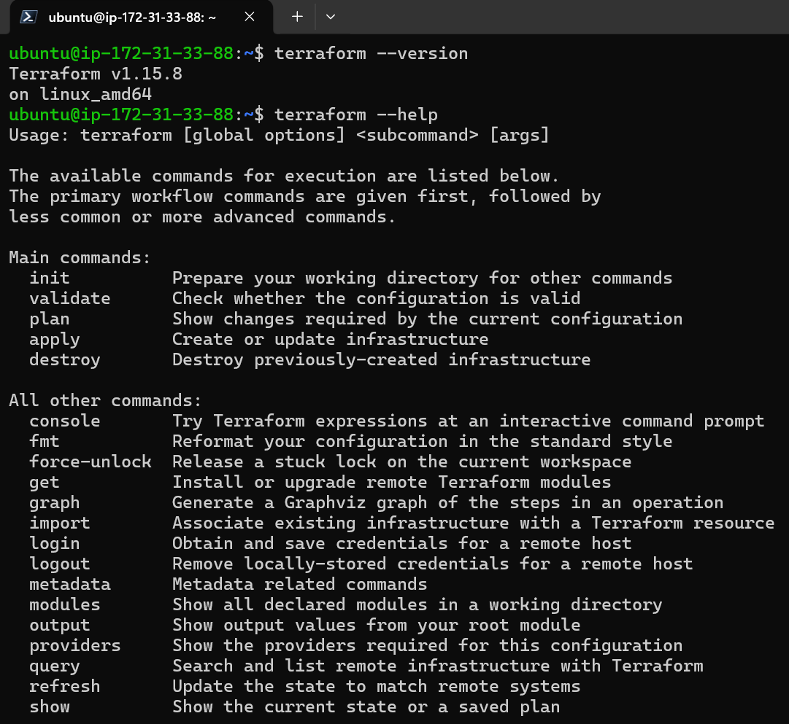
---

#### VS Code Extension

Installed the **HashiCorp Terraform** extension in VS Code for:

- Syntax highlighting
- Auto-completion
- HCL language support
- Error diagnostics
- Code formatting
- Resource navigation

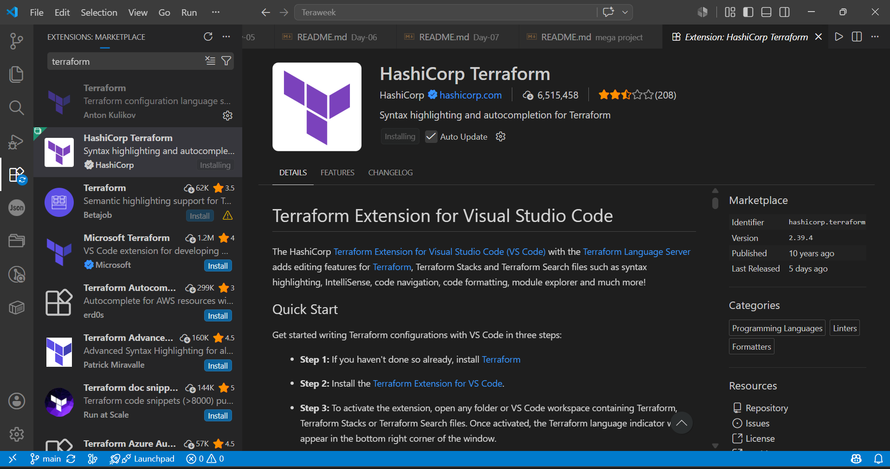

---

# 🎯 Task 3: Learn Core Terraform Concepts

# 📘 Important Terraform Terminologies

Understanding these core Terraform concepts is essential for building, managing, and automating infrastructure effectively.

---

## 1️⃣ Provider

A **Provider** is a plugin that allows Terraform to interact with external platforms, cloud providers, or services. Providers act as the bridge between Terraform and the infrastructure you want to manage.

### Common Providers

- AWS
- Microsoft Azure
- Google Cloud Platform (GCP)
- Docker
- Kubernetes
- GitHub
- Local
- Random

### Example

```hcl
provider "aws" {
  region = "ap-south-1"
}
```

---

## 2️⃣ Resource

A **Resource** is the fundamental building block in Terraform. It represents an infrastructure component that Terraform creates, updates, or deletes.

### Examples

- EC2 Instance
- S3 Bucket
- Virtual Machine
- Docker Container
- Local File
- Security Group

### Example

```hcl
resource "local_file" "example" {
  filename = "hello.txt"
  content  = "Hello Terraform"
}
```

---

## 3️⃣ State

Terraform stores information about the infrastructure it manages in a **State File** named:

```text
terraform.tfstate
```

The state file keeps track of existing resources so Terraform can compare the current infrastructure with the desired configuration.

### Purpose

- Tracks managed infrastructure
- Maps configuration to real resources
- Detects infrastructure changes
- Enables incremental updates

---

## 4️⃣ Plan

Before making any infrastructure changes, Terraform creates an **Execution Plan** that previews what actions will be performed.

The plan helps you review changes before applying them.

### The Plan Shows

- Resources to be created
- Resources to be modified
- Resources to be replaced
- Resources to be destroyed

### Command

```bash
terraform plan
```

---

## 5️⃣ HCL (HashiCorp Configuration Language)

**HCL** is Terraform's declarative configuration language used to define infrastructure.

It is designed to be:

- Human-readable
- Easy to write
- Easy to maintain

Terraform configuration files use the **`.tf`** extension.

### Example

```hcl
resource "random_pet" "name" {
  length = 2
}
```

---

## 6️⃣ Module

A **Module** is a reusable collection of Terraform configuration files that groups related resources together.

Modules help reduce code duplication and improve maintainability.

### Benefits

- Reusable code
- Better project organization
- Easier maintenance
- Standardized infrastructure

### Example

```hcl
module "network" {
  source = "./modules/network"
}
```

---

## 📋 Quick Summary

| Terminology | Description |
|-------------|-------------|
| **Provider** | Plugin that enables Terraform to communicate with cloud providers and services. |
| **Resource** | Infrastructure object managed by Terraform. |
| **State** | File that stores the current state of managed infrastructure. |
| **Plan** | Preview of infrastructure changes before deployment. |
| **HCL** | HashiCorp Configuration Language used to write Terraform configurations. |
| **Module** | Reusable collection of Terraform configuration files. |

---

# 🎯 Task 4: First Terraform Project

Created a simple Terraform project using the **Local** and **Random** providers to understand the Terraform lifecycle without requiring any cloud account.

---

# 🔄 Terraform Workflow

Terraform follows a structured workflow to provision and manage infrastructure safely and efficiently.

```text
Write Configuration (.tf)
        │
        ▼
terraform init
        │
        ▼
terraform fmt
        │
        ▼
terraform validate
        │
        ▼
terraform plan
        │
        ▼
terraform apply
        │
        ▼
Verify Infrastructure
(terraform output)
        │
        ▼
terraform destroy
```

---

## 📖 Workflow Explanation

### 1️⃣ Write Configuration

Create Terraform configuration files (`.tf`) to define your infrastructure using **HashiCorp Configuration Language (HCL)**.

---

### 2️⃣ Initialize Terraform

Downloads the required providers and initializes the working directory.

```bash
terraform init
```
### Screenshot

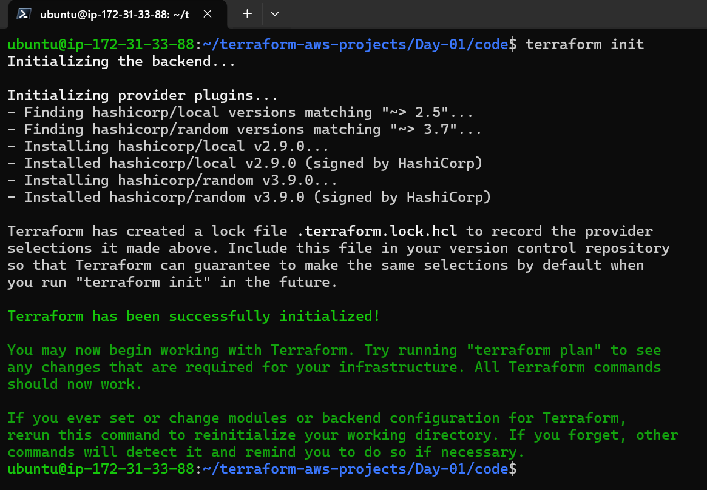

---

### 3️⃣ Format Configuration

Formats Terraform files according to standard HCL style.

```bash
terraform fmt
```

---

### 4️⃣ Validate Configuration

Checks the configuration for syntax errors and validates its correctness.

```bash
terraform validate
```
### Screenshot

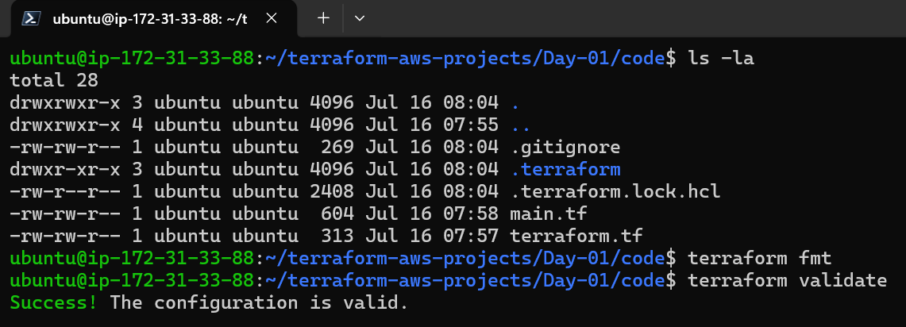

---

### 5️⃣ Preview Changes

Generates an execution plan showing what Terraform will create, modify, or destroy.

```bash
terraform plan
```
### Screenshot

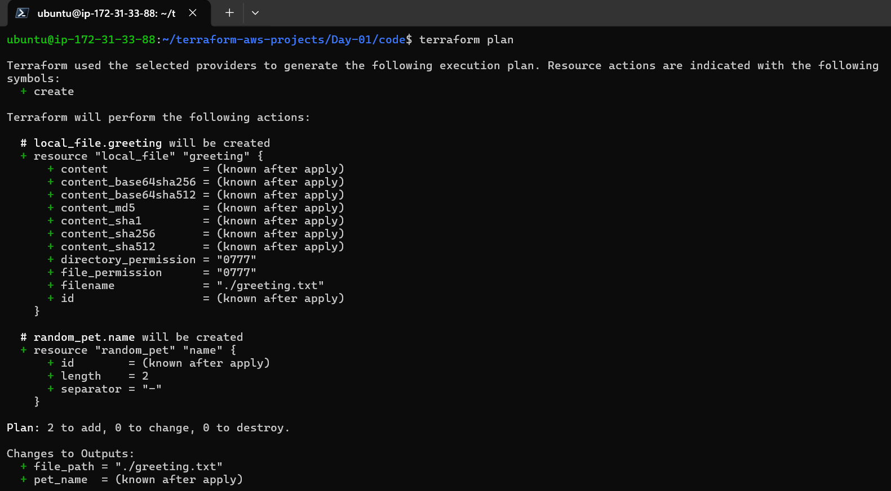

---

### 6️⃣ Apply Configuration

Creates or updates infrastructure based on the execution plan.

```bash
terraform apply
```
### Screenshot

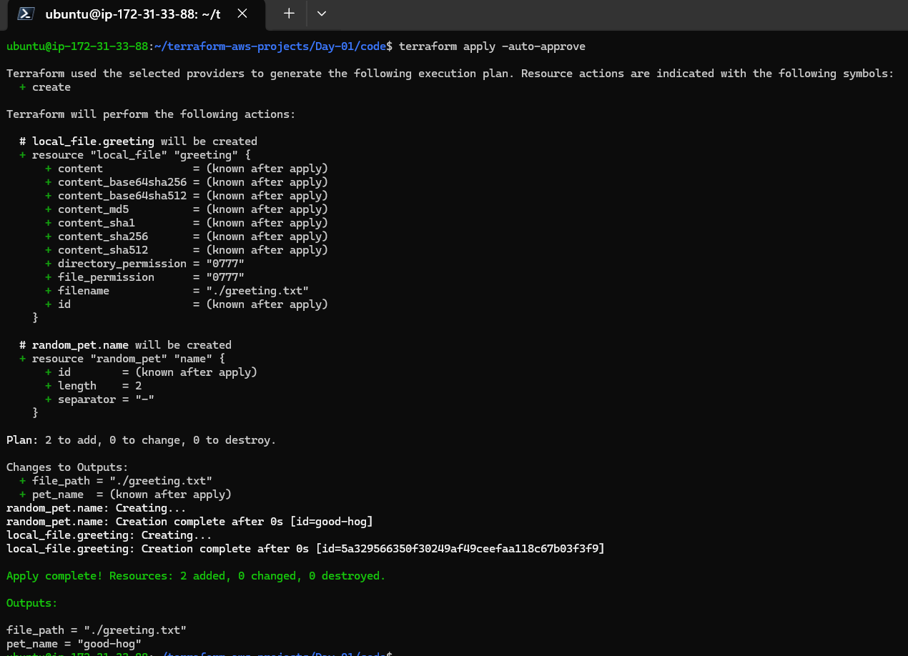
---

### 7️⃣ Verify Outputs

Displays the output values defined in the Terraform configuration.

```bash
cat greetings.txt
```
### Screenshot

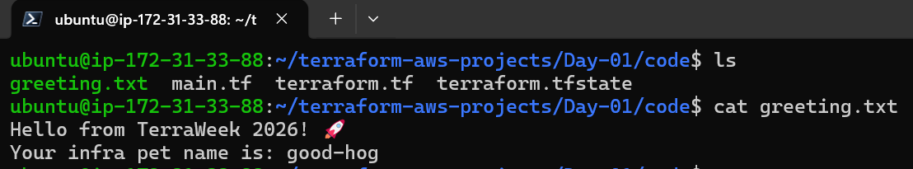

---

### 8️⃣ Destroy Infrastructure

Removes all resources created by Terraform.

```bash
terraform destroy
```
### Screenshot

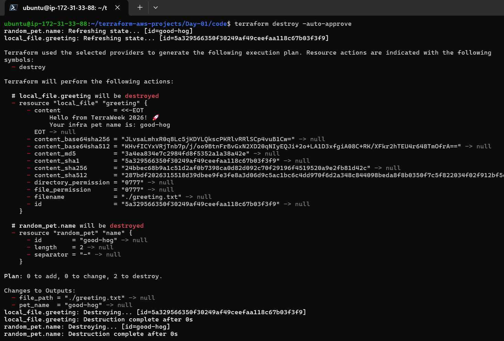
---


# 🎯 Learning Outcomes

By the end of Day 1, I was able to:

- Understand what Infrastructure as Code (IaC) is.
- Learn why Terraform is one of the most popular IaC tools.
- Install and configure Terraform.
- Understand the Terraform workflow.
- Learn important Terraform terminologies.
- Provision my first infrastructure locally.
- Destroy the infrastructure safely.
- Explore OpenTofu and Terraform Lock File.

---

# ⭐ Bonus Tasks

Completed additional Terraform exercises.

| Task | Status |
|------|:------:|
| Terraform CLI Autocomplete | ✅ |
| OpenTofu Installation | ✅ |
| Understanding `.terraform.lock.hcl` | ✅ |

---

## Bonus 1 – Terraform CLI Autocomplete

Verified Terraform CLI autocomplete.

```bash
terraform -install-autocomplete
```

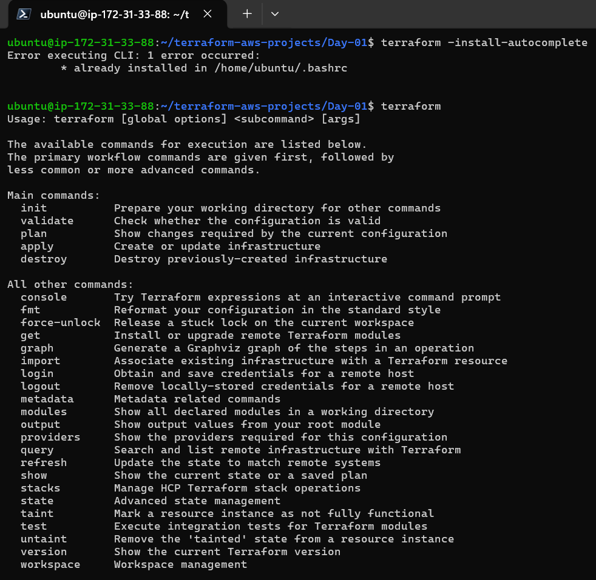

---

## Bonus 2 – OpenTofu

Installed OpenTofu and executed the same Terraform workflow.

### Installation

```bash
sudo snap install opentofu --classic
```

### Verify Installation

```bash
tofu version
```

### Workflow

```bash
tofu init
tofu fmt
tofu validate
tofu plan
tofu apply
tofu destroy
```

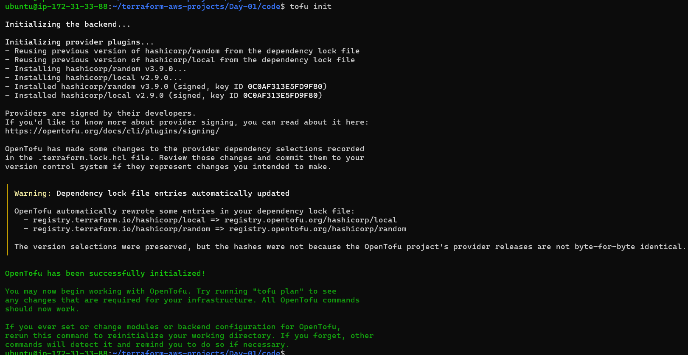
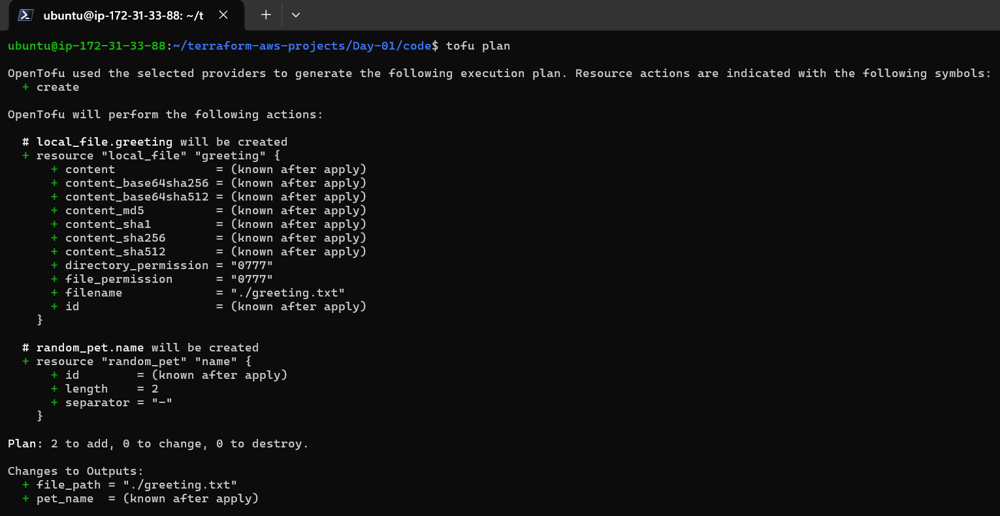
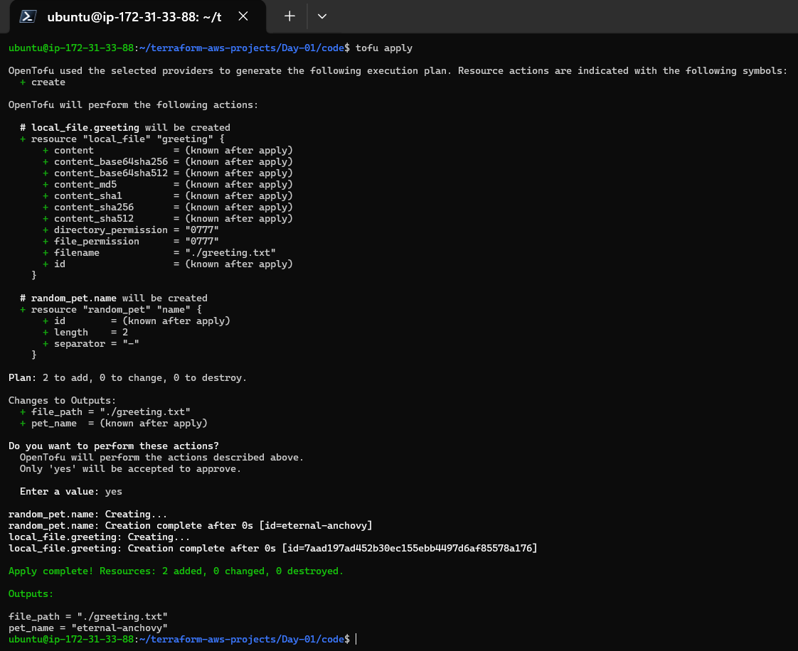
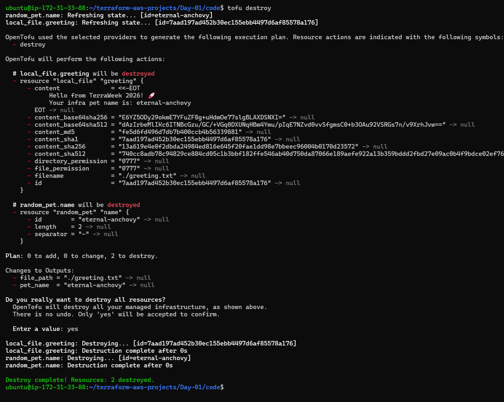


---

## Bonus 3 – Understanding `.terraform.lock.hcl`

Explored the `.terraform.lock.hcl` file generated during initialization.

### Purpose

- Locks provider versions
- Stores cryptographic checksums
- Ensures reproducible deployments
- Maintains provider consistency
- Improves security


---

# 📂 Repository Structure

```
terraform-aws-projects/
│
├── Day-01/
│   ├── README.md
│   ├── code/
│   └── images/
│
├── Day-02/
├── Day-03/
└── ...
```


---

---
# 🚀 Conclusion

Successfully completed the fundamentals of Terraform and Infrastructure as Code (IaC), including the complete Terraform workflow and OpenTofu basics. This marks the first step toward building scalable and automated cloud infrastructure.

---
# 🏷️ Tags

#TrainWithShubham #TerraWeekChallenge
---

## ⭐ If you found this project helpful, feel free to star the repository!
